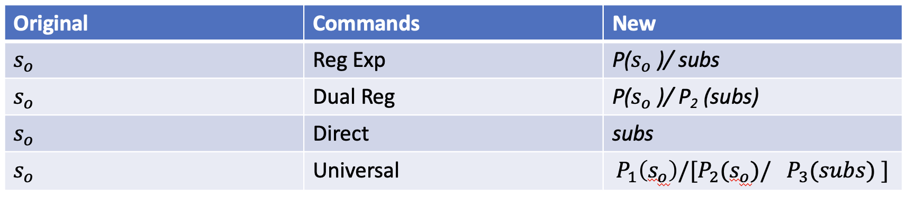

# Automator Data transformer

### Ziang Chen

This is a tool used for data transformation. It can be used to transform data from one format to another format. It can also be used to upload or download data from one place to another place.

### Table of content

- [Pre-requisite](#pre-requisite)

- [Configuration](#configuration)

- [Parameters](#parameters)

  - [nothing](#nothing)

  - [direct](#direct)

  - [regExp](#regexp)

  - [dualReg](#dualreg)

  - [Super](#super)

- [Example](#example)

## Pre-requisite

run the following command to install python3 and pip3

``` dotnetcli
apt-get install python3 python3-pip
```

install related libaray

``` dotnetcli
pip3 install -r requirements.txt
```

## Configuration

To enable upload and download, you need to mount NAS to your local machine. Reference to the following link for more information.

<https://man7.org/linux/man-pages/man8/mount.8.html>

## Parameters

--mR: mode of transformation

--sF: source folder

--tF: target folder

--sP: source pattern

--tP: target pattern

--p1: pattern 1

--p2: pattern 2

--p3: pattern 3

or reference to the following command

``` dotnetcli
python3 automator.py --help

usage: cloud automator [-h] [--mappingRule {regExp,dualReg,direct,super,nothing}] [--sub SUB] [--bP BP] [--sP SP] [--tP TP] [--tF TF] [--sF SF]

v 0.09 by Ziang Chen
options:
  -h, --help            show this help message and exit
  --mappingRule {regExp,dualReg,direct,super,nothing}, --mR {regExp,dualReg,direct,super,nothing}, -r {regExp,dualReg,direct,super,nothing}
                        select the mapping rule [refExp/dualReg]
  --sub SUB, --subsition SUB
                        substition word
  --bP BP, --p2 BP, --SubstitionPattern BP
                        substition pattern
  --sP SP, --p1 SP, --SourcePattern SP
                        source pattern
  --tP TP, --p3 TP, --TargetPattern TP
                        target pattern
  --tF TF, --TargetFolder TF
                        target Folder
  --sF SF, --SourceFolder SF
                        source Folder
```

Different mode of transformation means different mapping rule. The mapping rule is used to map the source file name to the target file name. The mapping rule can be one of the following:

- nothing
- direct
- regExp
- dualReg
- super

If source and target folder are same, then automator will simple excutting batch renaming operation based on the rule and pattern feed in to the automator

{width="528"}

### nothing

This rule is used for simple upload or download. It will not change the file name.

### direct

This rule is used for simple upload or download. It will not change the file name directly by replace the source pattern with substition.

### regExp

This rule is used the substition which is based on regular expression.

### dualReg

This rule using dual regular expression mapping. It will use the first regular expression to map the source file name to the target file name. Then it will use the second regular expression to map the target file name to the final file name.

### Super

THis rule using pattern 1 to locate the replace range, then using second pattern to indication the way mapping to the target file name based on the subs and pattern3.

## Example

example usage

``` dotnetcli
python3 automator.py  --mR "regExp"    --sF  "./"  --tF "./" --sP "*.py"   --tP "*.db"
```

For the "super" rule e.g. p1 = "\[a-z\].py" p2= "\[a-z\]." p3 = "\[1\]"

For simple upload or download can use

``` dotnetcli
python3 automator.py --mR nothing --sF "./test/testSrc/" --tF "./test/testTgt/" --sP "*"
```
